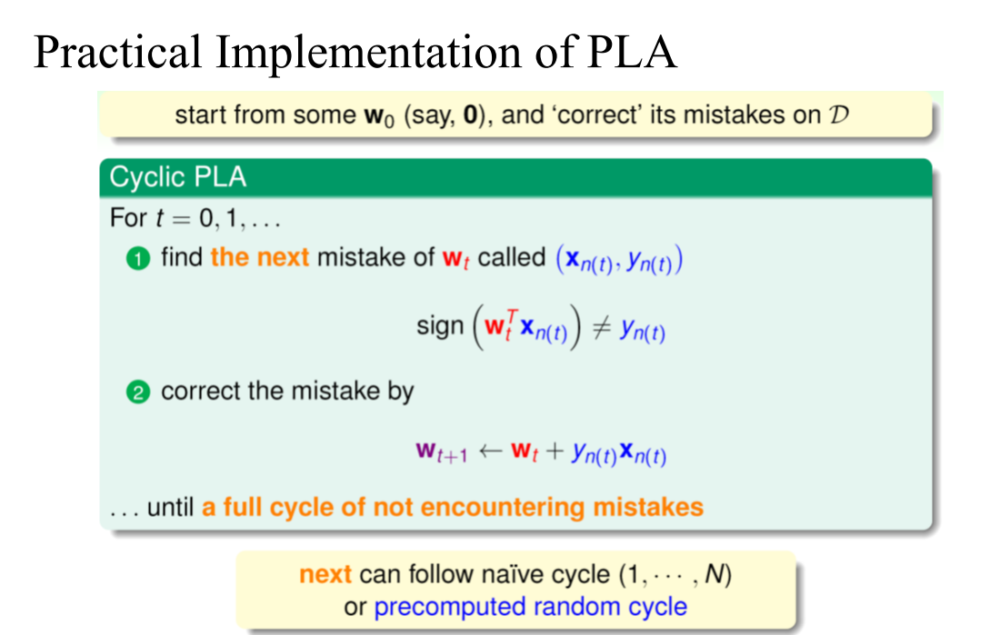

# CCU Machine Learning Homework2

## PLA
1. prediction=sign(wT ⋅ x)
    wT 是權重矩陣的轉置，表示一個行向量，包含了每個特徵的權重
    x 是特徵向量；
    sign(⋅) 將內積的結果取符號，即大於等於0時為+1，小於0時為-1。

2. 預測錯誤，則根據感知器學習規則進行權重的更新。將錯誤分類的樣本的特徵向量乘以其標籤（即誤差），然後加到權重向量上：
    w = w + y⋅x
   
    

## Pocket Algorithm
1. 目標是找到一個在訓練數據上表現最好的超平面，而不是完全分類訓練數據。
2. 保留一個“Pocket”來記錄在訓練過程中遇到的最佳權重，而不是在每次迭代中都更新權重。

## How to run
'''python
python PLA.py –-path filename -–save_img True 
'''
```python
def hello_world():
print("Hello, world!")
hello_world()
```
